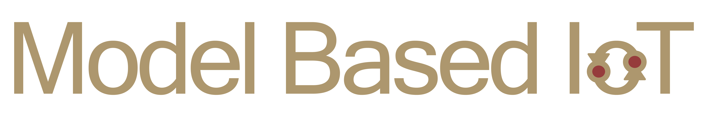
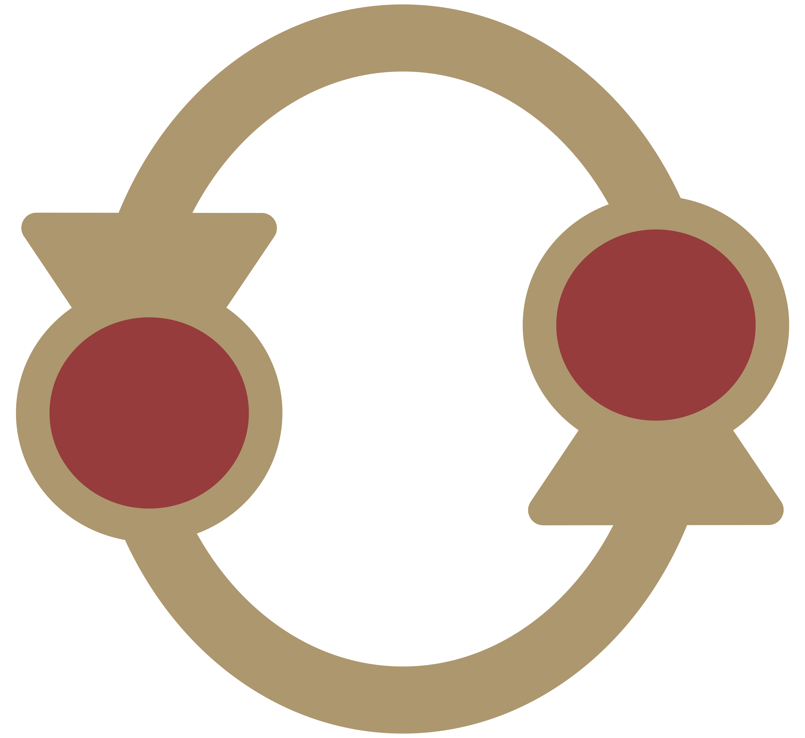

<!-- PROJECT LOGO -->
<br /></br>
<div align="center">
  
</div>
<div align="center">
  <!-- PROJECT SHIELDS -->
  <p align="center">
    </br>
    
    
    
    
    
  </p>

  <h3 align="center">IoT Devices</h3>
  <div align="center">
     <a href="">
      
    </a>
  </div>
  </br>
  <p align="center">
    Translate XML model into Python code
    <br />
    <a href="https://tcc2021seniorproject.github.io/"><strong>Visit our website for full documentation »</strong></a>
    <br />
    <br />
    <a href="https://docs.google.com/document/d/e/2PACX-1vRTo8ReSNkiQpujZEZgLHO4aHVmF3FWq7vQh247OKN9kj_EMBtQf2SMMnxD8Yfgk-3zjVv4AAqBx-2o/pub">View current process</a>
    ·
    <a href="https://github.com/TCC2021SeniorProject/ModelTranslator/issues">Report Bug</a>
    ·
    <a href="https://github.com/TCC2021SeniorProject/ModelTranslator/issues">Request Feature</a>
  </p>
</div>
</br>
</br>


## TABLE OF CONTENTS
<ol>
  <li><a href="#about-the-project">About the Project</a></li>
  <li><a href="#getting-started">Getting Started</a></li>
  <li><a href="#current-features">Current Features</a></li>
  <li><a href="#contact">Contact</a></li>
</ol>

</br>
</br>

<!-- ABOUT THE PROJECT -->
## About The Project

This project will assist developers in implementing custom IoT systems.

Here are the people who want to use this:

* Users who want to design automata system with UPPAAL
* Users who want their modeled diagrams to run on Rasberry Pis
* Users who want to test out IoT environment with the modeling tool (UPPAAL)


<p align="right">(<a href="#top">back to top</a>)</p>


<!-- GETTING STARTED -->
## Getting Started


### Prerequisites

Using pip3:
Download pycreate2, 
Download paramiko


### Demo Installation

1. Clone the repo
   ```sh
   git clone https://github.com/TCC2021SeniorProject/IoTdevices.git
   ```
2. Go into IoTdevices folder
   ```sh
   cd IoTdevices
   ```

3. Run DeviceSetup.py
   ```sh
   python3 DeviceSetup.py
   ```
   
3. Create a model

4. Write predefined code to go onto the IoT devices (examples in repo)

5. Write injection code to be combined with the model (examples in repo)

6. Include injection code when translating model

7. Save and run translator output

</br>

## Current Features

- DeviceSetup.py for ease of adding IoT devices
- deviceInterface.py for ease of writing and interfacing injection and predefined code
  - Connect(deviceIPs): Connects to all devices in the passed list deviceIPs
  - Send(com, deviceNum): Executes a command on a device using exec_command
  - SendAll(com): Executes a command on all connected devices using exec_command
  - Shell(com, deviceNum): Runs a command in a shell on a device, such as running a python script (predefined code) and passing input to it
  - ShellAll(com): Runs a command in a shell on all connected devices
  - Check(localpath, deviceNum): Checks to see if a device has a specified file
  - CheckAll(localpath): Checks to see if all devices have a specified file
  - Retrieve(remotepath, deviceNum): Attempts to download a specified file from a device
  - RetrieveAll(remotepath): Attempts to download a specified file from all devices. The device number is appended to the file name before the file extension.
  - Transfer(localpath, deviceNum): Sends a local file to a remote device. This allows for effectively scripted use of piTransfer.py
  - TransferAll(localpath): Sends a local file to all connected devices
  - Disconnect(): Disconnects from all devices

</br>
</br>


<!-- CONTACT -->
## Contact

#### Director
>  Dr. Siddhartha Bhattacharyya </br>
Email: [sbhattacharyya@fit.edu](mailto:sbhattacharyya@fit.edu)

#### Developers
> Sung-Jun Baek </br>
> Email: [roni2006@hanmail.net](mailto:roni2006@hanmail.net) </br>
> GitHub: [MarcoBackman](https://github.com/MarcoBackman)

> Caelan Shoop </br>
> Email: [cshoop2018@my.fit.edu](mailto:cshoop2018@my.fit.edu) </br>
> GitHub: [CCShoop](https://github.com/CCShoop)

> Cameron Wright </br>
> Email: [cameron2018@my.fit.edu](mailto:cameron2018@my.fit.edu) </br>
> GitHub: [CameronWr](https://github.com/CameronWr)


<p align="right">(<a href="#top">back to top</a>)</p>
